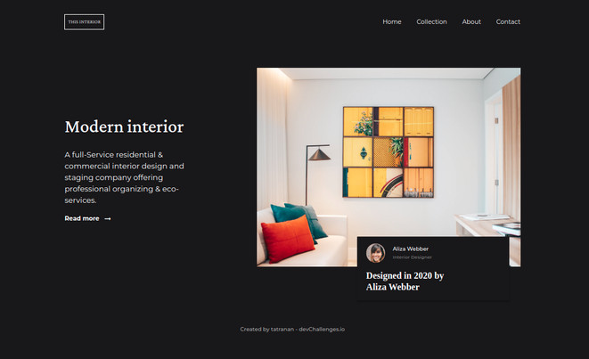

<h1 align="center">Interior Consultant Master</h1>

   Solution for a challenge from  <a href="http://devchallenges.io" target="_blank">Devchallenges.io</a>.

  <h3>
    <a href="https://tatranan.github.io/InteriorConsultantMaster-DevChallenge/">
      Demo
    </a>
     | 
    <a href="https://github.com/tatranan/InteriorConsultantMaster-DevChallenge">
      Solution
    </a>
     | 
    <a href="https://devchallenges.io/challenges/Jymh2b2FyebRTUljkNcb">
      Challenge
    </a>
  </h3>

## Table of Contents

- [Overview](#overview)
  - [Built With](#built-with)
- [Features](#features)
- [Contact](#contact)
- [Acknowledgements](#acknowledgements)

## Overview

- You can see demo in <a href="https://tatranan.github.io/InteriorConsultantMaster-DevChallenge/">here</a>
- I do the challenge to want practice more about HTML,CSS,JS.
- If my solution not suitable you can comment in my solution.

### Built With

- [HTML](https://www.w3schools.com/html/)
- [CSS](https://www.w3schools.com/css/)
- [JS](https://www.w3schools.com/js/)

## Features

This application/site was created as a submission to a [DevChallenges](https://devchallenges.io/challenges) challenge. The [challenge](https://devchallenges.io/challenges/Jymh2b2FyebRTUljkNcb) was to build an application to complete the given user stories.

## Acknowledgements

- [Style display Property](https://www.w3schools.com/jsref/prop_style_display.asp)
- [How TO - Overlay](https://www.w3schools.com/howto/howto_css_overlay.asp)

## Contact

- GitHub [tatranan](https://github.com/tatranan)
- Youtube [Drio Anden](https://www.youtube.com/channel/UC7CJBfb1bAIg6kCGmXwcoUQ/videos})
